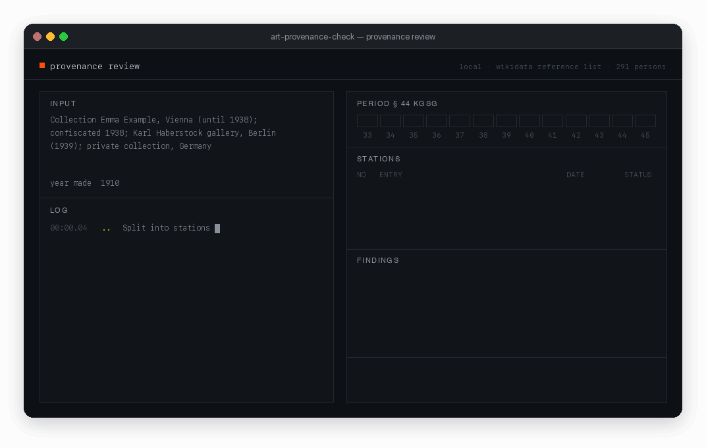
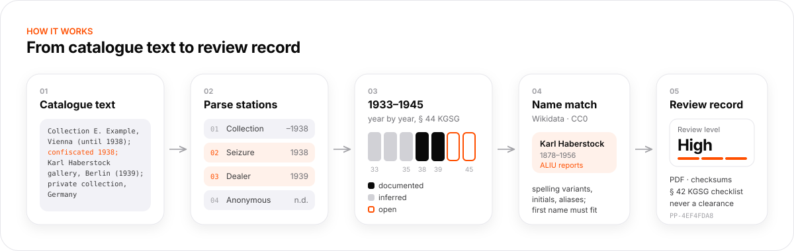
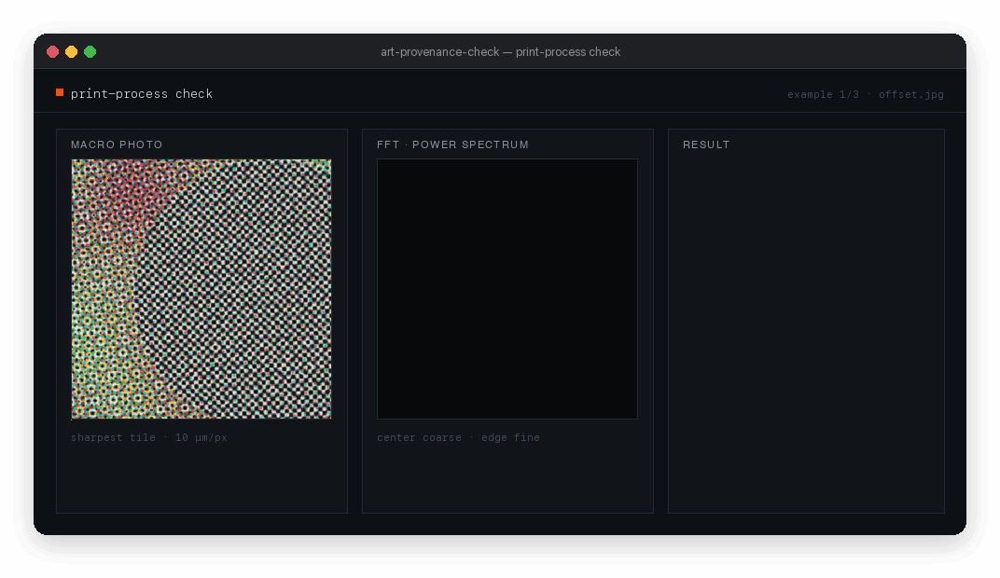
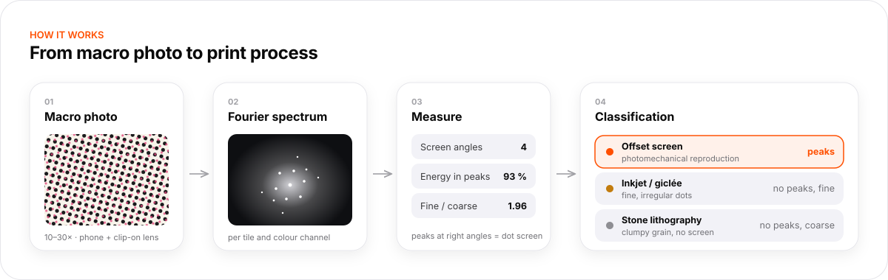
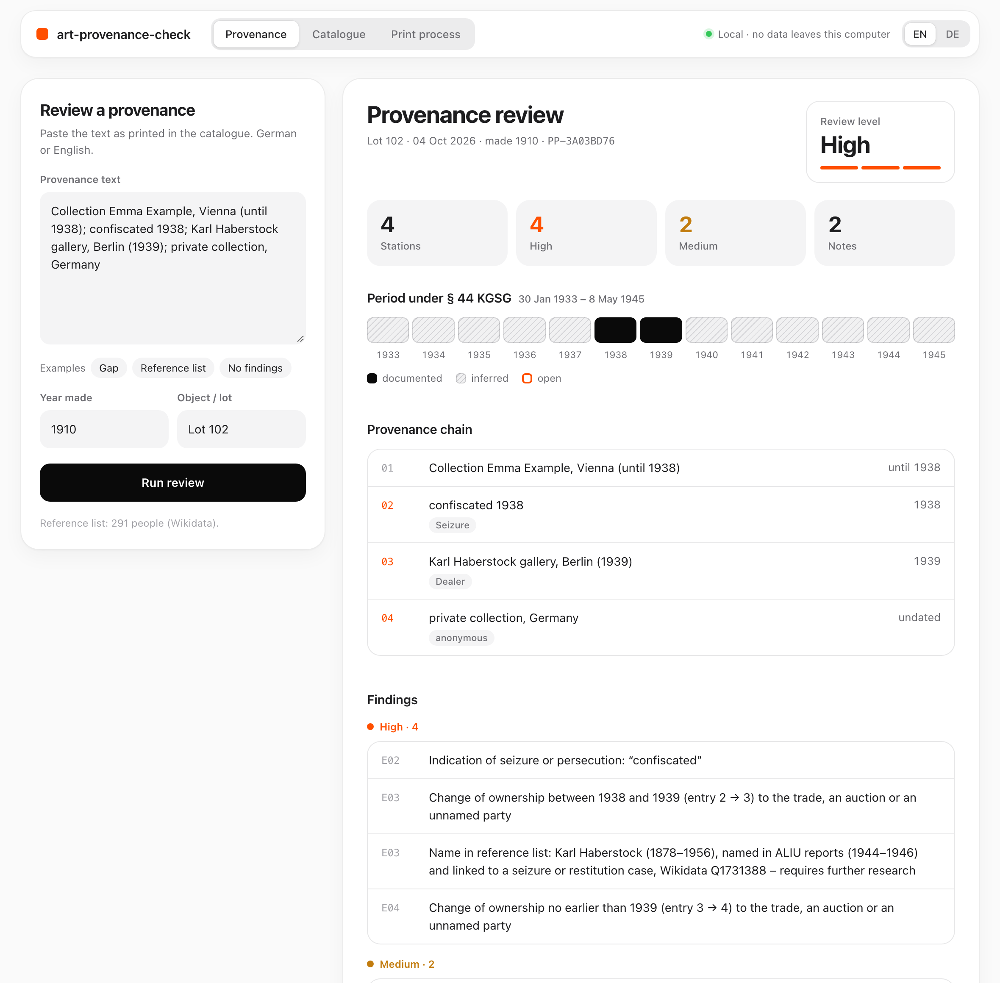
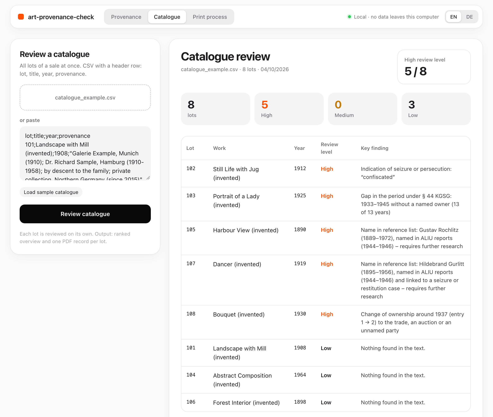
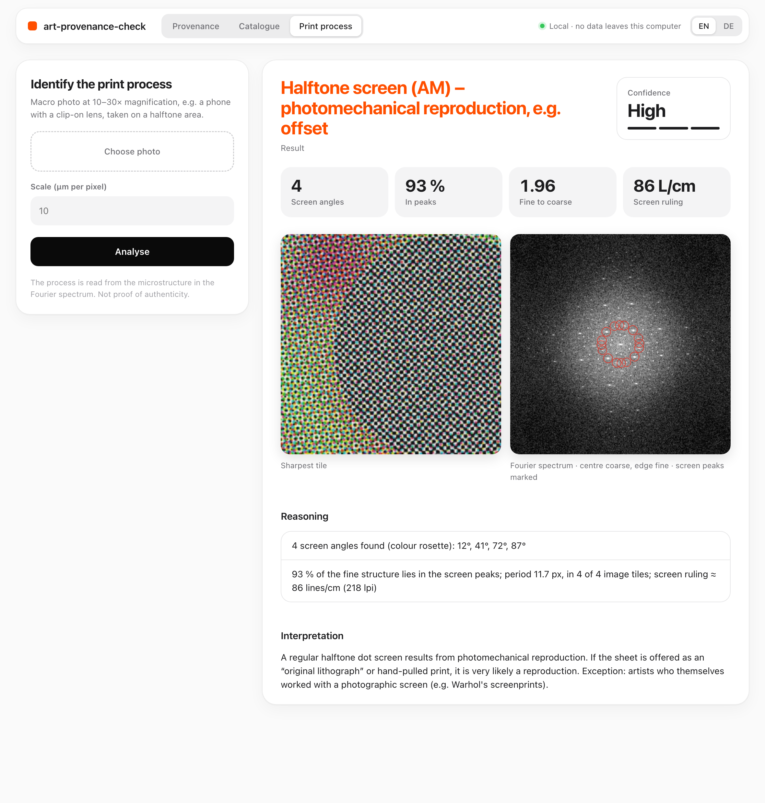

# art-provenance-check

Provenance and print-process due diligence for the art trade, run locally.

[](LICENSE)


art-provenance-check reads catalogue provenance texts in German or English and marks the parts that need further research, with a focus on 1933–1945. It reviews single works or entire auction catalogues, produces an audit record as PDF, and checks macro photos of prints for signs of photomechanical reproduction. Results are research hints, not legal advice.



▶ [Watch the 20-second demo](docs/demo.mp4) (MP4, 1.9 MB)

## Why

German law requires dealers and auction houses to exercise due diligence before placing cultural property on the market (Kulturgutschutzgesetz, KGSG, §§ 42–45):

- **§ 42:** check the provenance, search the relevant databases, and review the documents.
- **§ 44:** for works that may have been taken through Nazi persecution between 30 January 1933 and 8 May 1945, the usual value and effort thresholds do not apply. Every such work must be checked.
- **§ 45:** keep records of the checks for 30 years.

Large houses employ provenance researchers; small houses and dealers usually do not. This tool gives them a structured first pass and a record of what was checked.

## How it works



1. Split the provenance text into stations (owners, dealers, auctions, events) with dates.
2. Map the years 1933–1945 as documented, inferred, or open.
3. Flag ownership changes, confiscation and restitution keywords, anonymous and uncertain stations.
4. Match names against a reference list built from Wikidata.
5. Assign a review level (high, medium, low) and write the record.

The analysis is rule-based and transparent: every finding states its reason.

## Provenance review

```bash
python3 provenance.py "Collection A, Vienna (until 1938); art market, Zurich; private collection, Switzerland (since 1958)"
```

```bash
python3 provenance.py --file provenance.txt --year 1912 --object "Lot 123" --pdf record.pdf
```

Further options: `--record record.md` writes the record as Markdown, `--json` prints the full result as JSON. Output is available in English (default) and German (`--lang de`).

What it detects:

- **Stations and dates:** ranges, "until", "since", "about", decades. Life dates such as "b. 1881 – d. 1941" are not read as ownership. Prices, lot numbers and bracketed citations are ignored.
- **1933–1945, year by year:** documented, inferred, or open. The period starts no earlier than the year the work was made.
- **Ownership changes** in that period, stated as a time window, e.g. "between 1940 and 1946".
- **Keywords** for confiscation, forced sale, persecution, emigration, and restitution.
- **Anonymous or uncertain stations**, e.g. "private collection, Switzerland", "probably", "reportedly".
- **Names from the reference list:** a full match needs the surname plus the first name or its initial. Spelling variants, particles ("v. d."), maiden names and Wikidata aliases are recognized. A different first name rules a match out; a bare surname produces an "identify" hint.

The result is a **review level (high, medium, low)**, never a clearance. The audit record contains:

- the input text
- SHA-256 checksums of the input and of the reference list
- all parsed stations and findings
- the checklist of § 42 (1) KGSG, with database searches listed as open items

A sample record is in [`examples/review_record_example.pdf`](examples/review_record_example.pdf).

## Catalogue review

```bash
python3 provenance.py --catalogue catalogue.csv --out review/
```

The input is a CSV with a header row and the columns `lot;title;year;provenance`. German column names (`los;titel;entstehung;provenienz`) are also accepted, as are comma and tab separators. Only the provenance column is required.

The output folder contains:

- `overview.pdf`: all lots ranked by review level, each with its most important finding
- `overview.csv`: the same overview in machine-readable form
- `records/`: one PDF record per lot

A sample catalogue with invented lots is in `examples/catalogue_example.csv`.

## Print-process check



A regular dot screen under magnification points to a photomechanical reproduction, the most common finding with prints sold as original lithographs. The tool determines the print process from the Fourier spectrum of a macro photo taken at 10–30× magnification, for example with a phone and a clip-on lens.



```bash
python3 printcheck.py photo.jpg --um-per-px 8 --diagnose spectrum.png
```

`--um-per-px` sets the scale in micrometers per pixel and adds the screen ruling in lines per cm; `--diagnose` writes the spectrum as an image; `--json` prints the result as JSON.

- **Offset:** point-like peaks at right angles; several angles form a color rosette. Almost all fine structure sits in the peaks.
- **Inkjet / giclée:** no peaks, but strong fine structure (25–125 µm) relative to coarse structure (250–640 µm).
- **Stone lithography:** clumpy grain; the energy lies in coarse structure.
- **Flat print:** no microstructure, e.g. a screen print, or the photo is not magnified enough.

The sample photos in `examples/` (`offset.jpg`, `inkjet.jpg`, `litho.jpg`, `flat.jpg`) are synthetic and show each process at about 10 µm per pixel.

## Interface

```bash
python3 app.py
```

Then open http://localhost:8777. The interface defaults to English and has an EN/DE switch. Three tabs:

- **Provenance:** single review with a PDF record.
- **Catalogue:** CSV upload or paste, ranked overview, all records as one ZIP.
- **Print process:** photo upload with spectrum diagnosis.

The server listens on 127.0.0.1 only. No data leaves the machine.

<p>
  
  
  
</p>

## Installation

```bash
git clone https://github.com/Thesimpleex/art-provenance-check.git
cd art-provenance-check
pip install -r requirements.txt
```

Requires Python 3.9 or later. Dependencies are NumPy, SciPy and Pillow; the PDF output needs no further libraries. No account, no API key, no cloud service.

To install the command-line tools as well (`art-provenance-check`, `art-printcheck`, `art-provenance-app`):

```bash
pip install -e .
```

## Reference list

`data/reference_list_wikidata.csv` is built from Wikidata by `data/build_reference_list.py`. It includes people who:

- were investigated by the Art Looting Investigation Unit (ALIU, 1944–1946), or
- are on the Wikidata focus list "WikiProject Provenance" and have a documented link to Nazi plunder, "Aryanization", restitution, or Nazi persecution.

Name variants (German and English aliases) and life dates are included. A GitHub Action rebuilds the list on the first of every month and commits it only if the content changed; it aborts if the new list is empty or noticeably smaller than the current one. To rebuild it yourself (requires internet access):

```bash
python3 data/build_reference_list.py
```

Findings state only the category, life dates and Wikidata ID. An entry is a research hint, not a judgement about a person. The list is CC0, like its source.

To use your own list, pass `--reference-list my_list.csv`. The file is a CSV with the columns `name;note`, with names written as "Surname, First name".

## Limitations

- Rule-based parsing. Unusual phrasing can produce wrong stations or dates, so the record always shows the parsed stations for verification.
- The reference list is only as complete as Wikidata. No match does not mean a name is unproblematic.
- No lookup in Lost Art, Interpol ID-Art or the Art Loss Register, as none offers an open interface. The record lists these searches as open items.
- The print-process thresholds have not yet been calibrated on a large set of real macro photos. Photos of prints with a known process are welcome as contributions.

## Disclaimer

This tool does not provide legal advice and does not clear any work for sale. It supports your own research; it does not replace provenance research, database searches, or document review. Provided without warranty, see [LICENSE](LICENSE).

## License

- Code: [MIT](LICENSE)
- Reference list from Wikidata: [CC0 1.0](https://creativecommons.org/publicdomain/zero/1.0/)
